<!-- 顶部流动色条 -->

  

<h1 align="center">Welcome！ This is Leo.</h1>

<em>真理無相</em>

<!-- Eddy Covariance - Machine Learning - Software Development 动图 -->

  

<!-- 动态语言统计模块 - 基于真实仓库数据 -->

  

<!-- 提交信息：贪吃蛇效果（工作流会在仓库根目录生成 snake.svg / snake-dark.svg） -->

  <picture>
    <source media="(prefers-color-scheme: dark)" srcset="snake-dark.svg">
    <source media="(prefers-color-scheme: light)" srcset="snake.svg">
    
  </picture>

<!-- 底部流动色条 -->

  

